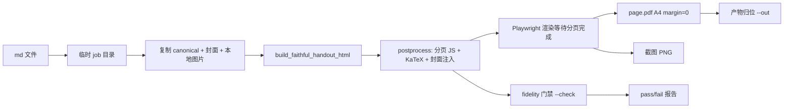

# mpe-export

无头 Markdown → HTML/PDF/PNG/JPEG 导出工具。基于 **crossnote**（VS Code 扩展 *Markdown Preview Enhanced* 的底层引擎），**不需要打开 VS Code 预览**即可导出，且所有参数可控。

专为 **agent / 大模型调用**设计：非交互式、`--json` 机器可读输出、明确退出码、宽松参数解析。

## 快速开始

```bash
cd C:\Users\lt\Desktop\Write\custom-project\mpe-export
npm install          # 安装依赖
npm link             # 注册到 PATH（全局命令 mpe-export），新开终端生效

# 任意目录直接调用：
mpe-export 笔记.md --format both          # 导出 HTML + PDF
mpe-export 报告.md --format pdf --json    # 只导 PDF，输出 JSON
```

> 要求：Node ≥ 18；PDF 导出依赖本机 Chrome/Edge（自动探测，也可用 `--chrome-path` 指定）。

## 用法

```
mpe-export <file.md> [<file2.md> ...] [选项]

使用说明书（裸命令 `mpe-export` 也会直接弹出完整手册）:
  mpe-export --help              完整手册
  mpe-export --help options      全部选项详解
  mpe-export --help presets      排版预设与选择指引
  mpe-export --help pagination   分页 / 标题换页 / 页脚 / 目录页（仅 PDF）
  mpe-export --help agent        Agent 使用手册（决策流程 / 意图映射 / JSON 协议）

选项:
  -f, --format <type>      pdf | html | png | jpeg | both (默认 both)
  -o, --out <dir>          输出目录 (默认: 源文件所在目录)
      --out-name <name>    输出文件名 (不含扩展名)
      --offline            HTML 导出为离线单文件（资源内联）
      --preset <name>      内置排版预设（--preset list 查看全部）
                           phycat: 讲义/试题 A4 排版（源自 scan-pdf-to-print-html 技能规格）
                           claude / claude-dark: Claude 主题风格（Typora claude-theme v19.7 提炼）
      --bg-pattern         保留 phycat 预设的背景图案层（网格/圆点；默认剥离，打印更干净）
      --footer             PDF 启用独立页脚（见下文「自动分页与独立页脚」；与预设正交）
      --pagination         PDF 只启用 sheet 自动分页（不加页脚；与预设正交）
      --pagination-level <h1|h2|h3>
                           标题换页（蕴含 --pagination）：父章节内第一个该级
                           标题不换页，其余该级标题各自起新页
      --toc                PDF 在正文前插入目录页（蕴含 --pagination；
                           带真实页码；条目过多自动续页）
      --toc-level <h1|h2|h3>
                           目录收录级别（默认 h3；单独使用即蕴含 --toc）
      --toc-title <text>   目录页标题（默认「目录」）
      --cover <file>       封面 html/png/jpg/svg（仅 PDF，蕴含分页）：
                           顺序固定为 封面 → 目录页 → 正文；封面无页脚但计入总页数
  -c, --config <json>      NotebookConfig JSON（引擎配置覆盖）
      --pdf-json <json>    PDF 参数，透传给 Chrome page.pdf()
      --html-json <json>   HTML 参数（embed_local_images / embed_svg / offline）
      --theme <name>       预览主题 (github-light.css / newsprint.css / ...)
      --code-theme <name>  代码高亮主题 (github.css / monokai.css / ...)
      --math <engine>      katex | mathjax | none
      --chrome-path <p>    Chrome/Edge 路径（默认自动探测）
      --print-background <true|false>
      --no-run-code-chunks 不执行代码块
      --fix-md             规范化源文档并写回（默认仅内存规范化：公式块/代码块/
                           引用块/callout/HTML块/表格/分割线/标题/列表 前后缺空行
                           自动补齐；写回留 .bak；front-matter: fix-md: true）
      --no-md-normalize    关闭内存规范化（front-matter: md-normalize: false）
      --no-bookmarks       关闭 PDF 书签大纲（默认开：按 h1-h6 标题层级生成，
                           阅读器侧栏跳转；front-matter: bookmarks: false）
      --open               导出后打开产物
  -j, --json               输出机器可读 JSON
  -q, --quiet              抑制日志
  -h, --help / -v, --version

退出码: 0 成功 | 1 导出失败 | 2 参数错误
```

## 自动分页、页脚与目录页（--pagination / --footer / --toc，仅 PDF）

**`--pagination`**（或 front-matter `pagination: true`）：PDF 不走 Chrome 原生
分页，改在浏览器内按块自动分页（移植并通用化 scan 技能
postprocess_handout_for_contract.py 的机制）——代码块 / 图片 / 引用块 / callout /
表格能放进一页就**绝不从中间切断**。与样式预设正交，任意预设可叠加。

**`--footer`**（或 front-matter `footer: true`）：在分页之上叠加 scan 风格页脚
（蕴含分页，无需再加 `--pagination`）：9px 灰字、顶部 1px 分隔线、左侧章节
面包屑（当前节点橙色高亮）、右侧 `第 N/M 页`。字体：数字/西文 Georgia、
中文思源宋体（均子集化内联）。

**`--toc`**（或 front-matter `toc: true`）：在正文前插入目录页（蕴含分页）。
先按 sheet 排完正文拿到真实页码，再生成「标题 ··· 页码」条目；条目过多
自动续页，页码计入目录页占用。`--toc-level h1|h2|h3`（默认 h3）控制收录
深度；`--toc-title` 改标题（默认「目录」）。「目录」进 PDF 书签，但不被
二次收录进目录。与 `--footer` 叠加时，目录页页脚显示「目录」。`--cover <file>` 把封面插在最前
（html 用 iframe 铺满 A4，png 用图），顺序：封面 → 目录 → 正文。

**`--pagination-level <h1|h2|h3>`**（或 front-matter `pagination-level: h2`）：
标题换页（蕴含分页，无需再加 `--pagination`）。规则是"**每个父章节内的第一个
该级标题不换页，其余该级标题各自起新页**"，更高级标题出现时重置"第一个"资格。
以 `h3` 为例：第一个 h2 不换页，从第二个 h2 起各自换页；每个 h2 手下的第一个
h3 跟着它不换页，从第二个 h3 起各自换页。`h2` 则只有二级标题按此规则换页。
分页器按文档顺序预标记再填充，尾部留白回填不会跨越强制换页边界。

页脚以绝对定位落在**下页边距带内**（距纸底 6mm），不挤占正文区——
正文上下边距保持预设定义值，视觉对称。面包屑直接复用标题里已渲染的
KaTeX 节点：标题含公式时页脚照常显示分式/上下标，并随页脚字号同比缩小。

分页机制细节：

1. 块级整页搬运——能放进一页的引用块 / callout / 图片 / 表格 / 代码块**绝不从中间打断**；
2. 连接词（因此/所以/解析…）与紧随的块级公式自动合并为一块；
3. 一整页都放不下的超长容器（引用块/callout/列表）按子节点拆分兜底，
   图片/公式/代码块等原子块不拆；
4. 尾部留白回填（>10% 空白时上提后续小块，标题/引用块受保护不动；
   `--pagination-level` 的强制换页边界不上提）；
5. 孤儿标题清扫：标题落在页尾时剥离并自然重排后续内容（保留标题换页标记）；
6. 仍超页的图片等比缩小兜底（防裁切）；
7.（仅 --toc）分页完成后按各页标题生成目录页，插在正文前，页码含目录占用；
8.（仅 --footer）扫描每页标题（h1–h4）生成面包屑——页脚天然知道当前页章节位置。

```bash
mpe-export 笔记.md -f pdf --preset phycat-sakura --pagination  # 主题风格 + 整块不断页
mpe-export 讲义.md -f pdf --preset phycat --footer   # 讲义排版 + 分页 + scan 风格页脚
mpe-export 笔记.md -f pdf --preset claude --footer   # claude 主题 + 同一页脚
mpe-export 讲义.md -f pdf --preset phycat --pagination-level h3  # 每节起新页（节内首个小节跟随）
mpe-export 讲义.md -f pdf --preset phycat --toc --footer         # 目录页 + 页脚页码
mpe-export 讲义.md -f pdf --preset claude --toc --footer --cover concept-map.html
```

## 块间空行规范化（默认自动）

`$$` 公式块、围栏代码块、引用块/callout、HTML 块、表格、分割线、ATX 标题、
列表**紧贴正文（前后无空行）**时，markdown 会把它们并进段落——最典型的事故：
`$$` 块里单独一行的 `=` 触发 setext 标题语法变成大号粗体"标题"、公式里的
`^` 被上标扩展吃掉、整块渲染为裸露 LaTeX 文本；Typora 则直接渲染失败。

导出前会**在内存中自动补齐块间空行**（规则见 `lib/normalize.js`，只加空行
不改内容，跳过 front-matter 与代码块/公式块内部），源文件不动；stderr 会
报告补了几处。两个相关开关：

- `--fix-md`（front-matter `fix-md: true`）：把规范化结果写回源文件（留
  `.bak` 备份）——源文件在 Typora 里也恢复正常；
- `--no-md-normalize`（front-matter `md-normalize: false`）：关闭该行为。

也可独立修复源文件（不导出）：

```bash
node tools/fix-md-spacing.js 讲义.md          # 就地修复（留 .bak）
node tools/fix-md-spacing.js --check 讲义.md  # 只报告缺几个空行
```

## 排版预设（--preset）

内置预设把常用排版规格打包成一条命令，CLI 显式参数优先于预设。

### `phycat` —— 讲义/试题 A4 排版

规格源自你的 `scan-pdf-to-print-html` 技能（`my-skills/custom/scan-pdf-to-print-html`）：

| 规格 | 值 |
|------|-----|
| 页面 | A4，内边距 上14mm/下15mm/左右13mm |
| 正文 | 12px，行高 1.56 |
| 标题 | h1 24px(1.15) / h2 22px / h3 18px / h4 15px / h5 13px |
| 页脚 | 9px 面包屑（自动提取文档标题）+ 第 X 页 / 共 Y 页 |
| 数学 | KaTeX（技能硬性契约，禁 MathJax） |
| 例题 | blockquote 红色左边线 + 浅底（近似 .phycat-blockquote） |
| 图片 | 按原图尺寸显示（1 图像素 = 1 CSS px），仅防溢出裁切 |

**标题分页**：`pagination-level`（h1/h2/h3，与技能 frontmatter-spec 兼容）现在由
sheet 分页器实现，语义为"父章节内第一个该级标题不换页，其余各自起新页"
（见上文「自动分页与独立页脚」），且对任意预设生效——设置即蕴含分页：

```yaml
---
pagination-level: h2
---
# 标题

## 第一讲   ← 第一个二级标题，不换页，跟着标题走
...
## 第二讲   ← 从新页开始
```

```bash
mpe-export 讲义.md --format pdf --preset phycat
```

**页脚面包屑**：预设自动把页脚左侧设为文档标题——提取顺序为
front-matter `title` > 文档第一个 `#` 标题 > 文件名。也可手动指定：

```bash
mpe-export 讲义.md --format pdf --preset phycat --footer-label "2026 导数专题 · 第11章"
```

> 差异说明：技能的分页是自定义 JS 分页流水线（含封面注入、孤儿标题防护、底部空白
> 校验），mpe-export 的预设是其轻量近似（CSS 分页）。如需技能的全套 fidelity 门禁
> （validate_* 校验器），请走技能流水线；mpe-export 预设适合快速出稿、agent 批量导出。

### `claude` / `claude-dark` —— Claude 主题风格（亮/暗）

提炼自 Typora 主题 **claude-theme v19.7**（`tools/build-claude-preset.js` 从其
`claude.css` / `claude-dark.css` 自动蒸馏生成，只保留文档内容样式，丢弃编辑器界面样式）：

| 规格 | 值 |
|------|-----|
| 背景 | 亮色 `#faf9f5`（米白纸感）/ 暗色 `#262624` |
| 正文 | Anthropic Serif 衬线体，正文最大宽 752px 居中 |
| 西文字体 | Anthropic Serif/Sans/Mono 已 base64 内联，产物零外部依赖 |
| 中文字体 | 完整字体内置在项目 `lib/presets/fonts/`（Noto Serif SC / Noto Sans SC / 思源黑体 Regular+Bold，约 76MB）；**导出时按文档实际用到的字符动态子集化**为 woff2 并内联，未装字体的机器打开产物也能正确显示（可变字重保留，粗体正常） |
| 点缀色 | Claude 橙 `#D97757`（链接、波浪高亮、下划线） |
| 代码块 | 圆角卡片 + 半透明描边；行内代码红棕色 |
| Callout | `[!note]` 等警告框映射主题 `.md-alert` 样式（note/tip/important/warning/caution 五色 + 强调色图标） |
| 打印 | 主题自带 `@media print` 适配（列表/表格/高亮打印修正） |

```bash
mpe-export 笔记.md --format both --preset claude        # 亮色 HTML + PDF
mpe-export 笔记.md --format html --preset claude-dark   # 暗色 HTML
```

> 说明：该预设是纯"风格预设"——不做标题分页、不注入页脚面包屑；PDF 默认
> A4 + 18mm/16mm 页边距，可用 `--pdf-json` 覆盖。背景色经 `@page { background }`
> 满版铺满整页（含页边距），不会出现"白底 A4 中间浮一块背景色块"的情况；页边距
> 即正文与页面边缘的距离。暗色预设默认搭配
> monokai 代码高亮 + mermaid dark 主题（可用 `--config` / `--code-theme` 覆盖）。
> 中文字体子集化失败（如 `subset-font` 依赖缺失）时静默降级为系统字体回退。
> 重新生成样式：`node tools/build-claude-preset.js <主题目录> claude.css lib/presets/claude.css`。

### `phycat-*` —— Phycat 主题配色变体（11 个，Typora typora-theme-phycat）

提炼自 Typora 主题 **typora-theme-phycat**（`tools/build-phycat-preset.js` 从
`phycat.light.css` / `phycat.dark.css` 两个基底 + 各变体的 `:root` 变量覆盖蒸馏生成，
一次产出全部 11 个预设 CSS）。统一特征：霞鹜文楷正文（CJK 按文档字符子集化内联）、
Cascadia Code 等宽（已 base64 内联）、正文 14px、标题阶梯 24/21/18/16/15/14px、
五级 callout 配色、代码块卡片头（红绿灯 + 右上角语言标签）、PDF `@page` 满版背景。主题自带的标题自动编号（`--autonum-*`
变量）在生成时已统一剥离——导出不带编号；如需恢复，注释掉
`build-phycat-preset.js` 中剥离 `--autonum-*` 的那段后重新生成即可。

| 预设 | 配色 | 亮/暗 |
|------|------|-------|
| `phycat-cherry` | 樱桃红 | 亮 |
| `phycat-caramel` | 焦糖橙 | 亮 |
| `phycat-forest` | 森绿 | 亮 |
| `phycat-mint` | 薄荷青 | 亮 |
| `phycat-sky` | 天蓝 | 亮 |
| `phycat-prussian` | 普鲁士蓝 | 亮 |
| `phycat-sakura` | 樱花粉 | 亮 |
| `phycat-mauve` | 淡紫 | 亮 |
| `phycat-vampire` | 吸血鬼（红紫霓虹） | 暗 |
| `phycat-radiation` | 辐射（荧光绿） | 暗 |
| `phycat-abyss` | 深渊（午夜蓝） | 暗 |

```bash
mpe-export 笔记.md --format both --preset phycat-sakura    # 亮色
mpe-export 笔记.md --format pdf --preset phycat-vampire    # 暗色
```

> 说明：与 claude 预设同为纯"风格预设"（不分页、无页脚面包屑），PDF 默认
> A4 + 18mm/12mm 页边距。亮变体白底（部分变体 `@page` 平铺低透明度强调色图案，
> 对应主题的背景 mask 机制）；暗变体整页铺 `--bg-color` + 圆点纹理，含页边距。
> 暗变体默认 monokai 代码高亮 + mermaid dark 主题。
> 重新生成样式：`node tools/build-phycat-preset.js [主题源目录]`（默认
> `C:/GhostDownload/Archives/typora-theme-phycat`）。

## 参数控制（三层，高→低）

| 层 | 方式 | 示例 |
|----|------|------|
| ① CLI / 调用参数 | `--pdf-json` / `--config` / `--offline` | `--pdf-json '{"format":"A4","margin":{"top":"15mm"}}'` |
| ② 文件 front-matter | md 头部 YAML | `chrome:` / `html:` / `print_background:`（见下方） |
| ③ `.crossnote/` 目录 | 项目目录下 | `config.js` / `style.less` / `head.html` / `parser.js`（自动加载） |

### front-matter 示例（每文件独立控制）

```yaml
---
title: 季度报告
print_background: true
chrome:                     # 直接透传 Chrome page.pdf() 参数
  format: A4
  margin: { top: 15mm, bottom: 15mm, left: 20mm, right: 20mm }
  displayHeaderFooter: true
  headerTemplate: '<div style="font-size:9px;color:#999;">报告</div>'
  footerTemplate: '<div style="font-size:9px;text-align:center;">第 <span class="pageNumber"></span> 页 / 共 <span class="totalPages"></span> 页</div>'
html:
  offline: true
  embed_local_images: true
---
```

> ⚠️ 注意：引擎源码中 PDF 参数 key 是 `chrome`（或 `puppeteer`），**不是** 旧文档里的 `pdf_options`。

## Agent / LLM 调用指南

以下说明可直接提供给任何 agent 或大模型：

```
工具名: mpe-export（已注册到系统 PATH，任意目录可直接调用）
用途: 将 Markdown 无头导出为 HTML/PDF/PNG/JPEG（无需打开 VS Code 预览）
调用方式: 在 shell 中执行 `mpe-export <file.md> [选项]`

推荐用法:
  1. 先查帮助:        mpe-export --help
  2. 标准调用:        mpe-export <绝对或相对路径>.md --format both
  3. 机器可读输出:    加上 --json 参数，stdout 只会输出一个 JSON 对象:
     {"ok":true,"tool":"mpe-export","version":"1.0.0","durationMs":1234,
      "files":[{"input":"C:/.../a.md","outputs":{"pdf":"C:/.../a.pdf","html":"C:/.../a.html"},"ok":true}]}
  4. 批量:            mpe-export a.md b.md c.md --format pdf --out ./out
  5. 控制 PDF 参数:   --pdf-json '{"format":"A4","landscape":true,"displayHeaderFooter":true}'
  6. 控制引擎配置:    --config '{"previewTheme":"newsprint.css","mathRenderingOption":"MathJax"}'

风格选择（用户只说"打印/导出"、没指定样式时）:
  1. mpe-export --preset list     # JSON 列出全部预设（含 description/usage）及 lastUsed（上次预设）
  2. 主动向用户确认风格偏好:      claude（亮色主题风）/ claude-dark（暗色）/ phycat（讲义 A4）/ 默认简洁
     有 lastUsed 时把它作为推荐默认值，问用户是否沿用
  3. 带上 --preset <name> 导出；沿用上次可直接 --preset last
     用户对结果不满意时，按预设文档调整参数重导

关键约定:
  - 完全非交互式: 永不等待输入、不弹窗。调用后阻塞直到完成或失败。
  - 退出码: 0=成功, 1=导出失败, 2=参数错误。判断成败请依据退出码而非文本。
  - 失败时: --json 模式下 stdout 输出 {"ok":false,"tool":"mpe-export","error":"<原因>"}。
  - stdout 纯净: --json 模式下所有进度日志都写到 stderr，stdout 只有 JSON。
  - 不修改源文件: 参数注入通过同目录临时副本实现，导出后自动清理。
  - 输出位置: 默认与源文件同目录同名；可用 --out 指定目录、--out-name 改名。
  - PDF 依赖本机 Chrome/Edge（自动探测）; 若失败请用 --chrome-path 显式指定浏览器路径。
  - 文件路径: 绝对路径最稳；相对路径相对调用时的当前工作目录解析。
  - 首次调用较慢(1-3s): 引擎需加载 crossnote 及其依赖，属正常现象。
```

### 从 Node.js 代码调用（库模式）

```javascript
const { exportMarkdown } = require('mpe-export');

const r = await exportMarkdown({
  file: 'C:/notes/report.md',
  format: 'both',
  offline: false,
  pdfJson: { format: 'A4', margin: { top: '15mm' } },
  config: { previewTheme: 'newsprint.css' },
});
console.log(r.outputs); // { pdf: '.../report.pdf', html: '.../report.html' }
```

## 常见问题

- **Chrome executable path is not set** → 用 `--chrome-path "C:/Program Files/Google/Chrome/Application/chrome.exe"` 指定，或安装 Chrome。
- **中文字体/乱码** → 由本机 Chrome 渲染，通常无问题；若 PDF 缺字体，检查系统字体。
- **想改输出文件名** → `--out-name 自定义名`。
- **离线 HTML 图片打不开** → 加 `--html-json '{"embed_local_images":true}'`。
- **跨平台** → 代码兼容 Windows/Linux/macOS（浏览器探测已内置三平台常见路径）。

## 机器化流水线（--pipeline）

**不复制、不重写**——直接调度你的 `scan-pdf-to-print-html` 技能现成流水线，
一条命令全自动出稿：

```bash
mpe-export 讲义.md --format pdf --pipeline --check
```

自动执行：



保留技能全部 fidelity：**JS 分页器**（标题换页、底部空白优化、孤儿标题防护）、
封面自动注入、KaTeX 硬契约、图片宽度带。

### 选项

- `--check`：跑 `validate_rendered_handout_contract` + `validate_sheet_bottom_margin`，JSON 报告 pass/fail
- `--screenshot`：同时产出整页截图 PNG（供审阅）
- `--keep-job` / `--job-dir <dir>`：保留/指定作业目录（默认临时目录用完删除）
- `--python-cmd <cmd>`：Python 命令（默认 `py -3`）
- `--skill-scripts <dir>`：技能脚本目录（默认自动定位 my-skills/custom/scan-pdf-to-print-html）
- `--no-normalize`：关闭 doc2x 前置规范化（默认开）：
  1. `**解析**` 类纯加粗短标签 → `####` 标题（doc2x 把标题转成加粗文本，技能默认只当 lead-tag）
  2. callout 题号行后插空引用行（markdown 无空行会把题号与题干并成一段）
  3. 文档无 `#` 一级标题时提升首个标题行（避免 build 兜底抓正文公式行当 `<title>`）
- `--no-katex-local`：关闭 KaTeX 本地化（默认开）：从 node_modules/katex 复制资源、改写 CDN 引用，离线渲染，规避 jsdelivr 在中国网络的不稳定

### 自动化上限（诚实边界）

| 环节 | 自动化程度 |
|------|-----------|
| 全链路出稿（build→分页→渲染→归位） | ✅ 全自动 |
| fidelity 门禁（渲染契约 / 底部空白） | ✅ 自动跑并报告 pass/fail（13 项渲染契约） |
| doc2x 转录格式规范化（加粗标题/题号行/缺 h1） | ✅ 自动（--no-normalize 可关） |
| KaTeX 离线渲染（无 CDN 依赖） | ✅ 自动本地化（--no-katex-local 可关） |
| 封面：目录已有 concept-map.png | ✅ 自动注入 |
| 封面：缺失时 AI 生成（a4-novak-html-cover） | ⚠️ 需 LLM 介入，pipeline 会检测并提示 |
| validator fail 的自动修复 | 🔶 单轮按 hint 修可脚本化，通用循环需智能决策（建议人工/agent 审） |
| 审阅子代理（reviewer subagents） | 🔶 需 agent/LLM，pipeline 产出 PDF+PNG 供审阅 |

### 三种引擎对比

| 模式 | 引擎 | 特点 | 速度 |
|------|------|------|------|
| 默认 | crossnote | 轻量、极快、参数全可控 | ~3-5s |
| `--preset phycat` | crossnote + 排版预设 | 讲义风格 A4/面包屑/标题分页近似 | ~5s |
| `--pipeline` | scan-pdf 技能 | 100% fidelity（JS 分页/封面/门禁） | ~20-60s |

## 开发

```bash
node test/smoke.js   # 冒烟测试
```
