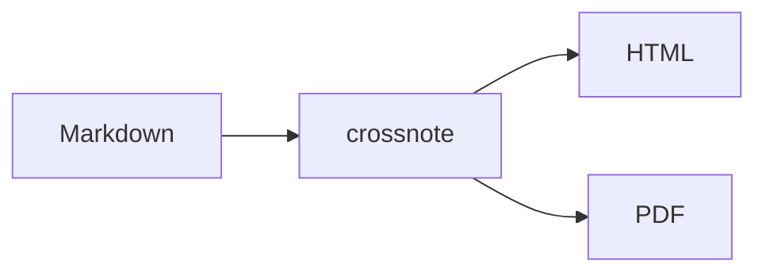

# mpe-export 示例文档

本文档演示 mpe-export 支持的能力。

## 数学公式

行内公式 $E = mc^2$，块级公式：

$$
\int_{-\infty}^{\infty} e^{-x^2}\,dx = \sqrt{\pi}
$$

## 代码高亮

```python
def hello(name: str) -> str:
    return f"Hello, {name}!"

print(hello("World"))
```

## Mermaid 图表



## 表格

| 功能 | 状态 |
|------|------|
| HTML 导出 | ✅ |
| PDF 导出 | ✅ |
| 参数控制 | ✅ |

## Callout

> [!note] 笔记
> 五种内置类型：note / tip / important / warning / caution。

> [!warning] 警告
> 支持嵌套**加粗**、`行内代码` 和公式 $a^2+b^2=c^2$。

## 目录

<!-- @import "[TOC]" {cmd="toc" depthFrom=2 depthTo=3} -->

<!-- code_chunk_output -->

- [数学公式](#数学公式)
- [代码高亮](#代码高亮)
- [Mermaid 图表](#mermaid-图表)
- [表格](#表格)
- [Callout](#callout)
- [目录](#目录)

<!-- /code_chunk_output -->

