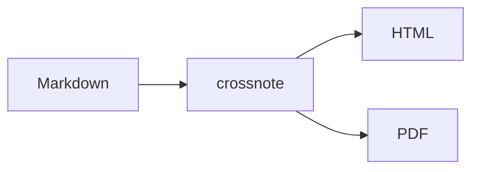
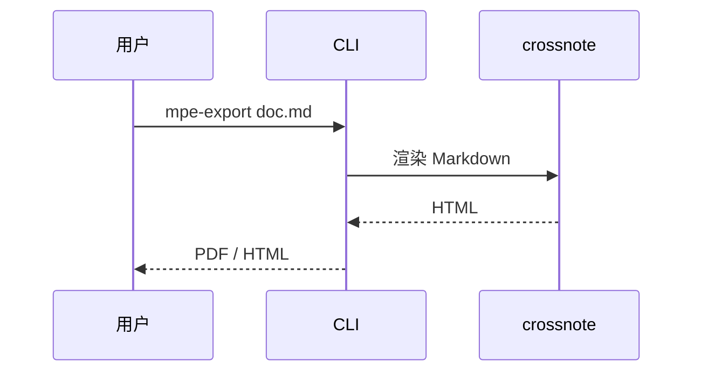

# mpe-export 全语法示例

本文档覆盖 mpe-export（crossnote 引擎）支持的全部 Markdown 语法，用于对比各导出预设的渲染效果。

## 标题层级

# 一级标题 H1
## 二级标题 H2
### 三级标题 H3
#### 四级标题 H4
##### 五级标题 H5
###### 六级标题 H6

## 文本样式

普通段落，混排中英文与数字 123。**加粗**，*斜体*，***加粗斜体***，~~删除线~~，==高亮标记==，`行内代码`，下标 H~2~O，上标 X^2^，Emoji :smile: :rocket:，缩写词 HTML 悬停可见全称。

第二段落，测试段落间距与行高。The quick brown fox jumps over the lazy dog，敏捷的棕色狐狸跳过懒狗。

## 链接与图片

[行内链接：GitHub](https://github.com) 与自动链接 https://example.com 。

本地图片：


## 引用块

> 单层引用：路漫漫其修远兮，吾将上下而求索。
>
> > 嵌套引用：引用中的引用。
>
> 引用中混排 **加粗**、`代码` 与公式 $e^{i\pi}+1=0$。

## 列表

无序列表：

- 苹果
- 香蕉
  - 二级嵌套项
  - 再嵌套
    - 三级嵌套项
- 樱桃

有序列表：

1. 第一项
2. 第二项
   1. 有序嵌套 2.1
   2. 有序嵌套 2.2
3. 第三项

混合列表：

- 混合外层
  1. 内层有序
  2. 内层有序二

## 分割线

上文内容。

---

下文内容。

## 表格

| 左对齐 | 居中对齐 | 右对齐 |
|:-------|:--------:|-------:|
| 苹果 | ¥3.00 | 100 |
| 香蕉 | ¥2.50 | 2000 |
| **加粗单元格** | `code` | [链接](https://example.com) |

## 代码块

```python
def fibonacci(n: int) -> list[int]:
    """生成斐波那契数列"""
    seq = [0, 1]
    while len(seq) < n:
        seq.append(seq[-1] + seq[-2])
    return seq
```

```javascript
const greet = (name) => {
  console.log(`Hello, ${name}!`); // 模板字符串
};
```

```diff
- const oldValue = 1;
+ const newValue = 2;
```

## 数学公式（KaTeX）

行内公式：质能方程 $E = mc^2$，欧拉恒等式 $e^{i\pi} + 1 = 0$。

块级公式：

$$
\frac{\partial}{\partial t} \Psi = \frac{i\hbar}{2m} \nabla^2 \Psi
\qquad
\sum_{n=1}^{\infty} \frac{1}{n^2} = \frac{\pi^2}{6}
$$

## Mermaid 图表

流程图：



时序图：



## Callout 警告框

> [!note] 
> 这是 note 类型，支持嵌套 **加粗**、`行内代码` 与公式 $a^2+b^2=c^2$。

> [!NOTE] 
> Highlights information that users should take into account.


> [!tip] 提示
> 这是 tip 类型。

> [!important] 重要
> 这是 important 类型。

> [!warning] 警告
> 这是 warning 类型。

> [!caution] 当心
> 这是 caution 类型。

## 脚注与定义列表

这是一个带脚注的句子[^1]，另一个脚注[^note]。

[^1]: 脚注一的内容。
[^note]: 脚注二的内容，支持 **格式**。

术语定义列表：

Term 1
:   定义一的内容。

Term 2
:   定义二的第一段。
:   定义二的第二段。

## 目录

<!-- @import "[TOC]" {cmd="toc" depthFrom=1 depthTo=3} -->

<!-- code_chunk_output -->

- [mpe-export 全语法示例](#mpe-export-全语法示例)
  - [标题层级](#标题层级)
- [一级标题 H1](#一级标题-h1)
  - [二级标题 H2](#二级标题-h2)
    - [三级标题 H3](#三级标题-h3)
  - [文本样式](#文本样式)
  - [链接与图片](#链接与图片)
  - [引用块](#引用块)
  - [列表](#列表)
  - [分割线](#分割线)
  - [表格](#表格)
  - [代码块](#代码块)
  - [数学公式（KaTeX）](#数学公式katex)
  - [Mermaid 图表](#mermaid-图表)
  - [Callout 警告框](#callout-警告框)
  - [脚注与定义列表](#脚注与定义列表)
  - [目录](#目录)

<!-- /code_chunk_output -->
